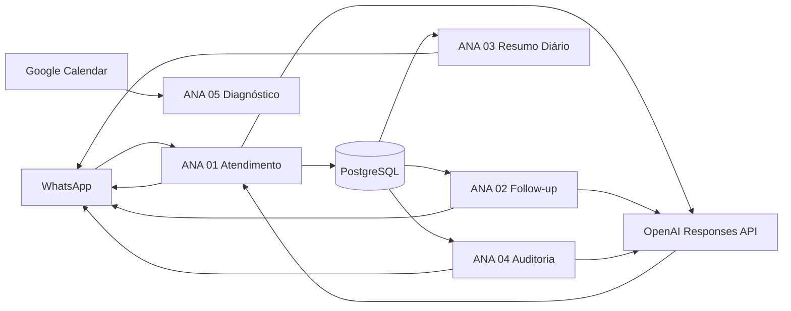

# Arquitetura e fluxo de dados

## Objetivo

A ANA atende pacientes pelo WhatsApp, interpreta pedidos médicos, consulta preços oficiais, acompanha oportunidades e produz relatórios operacionais. O n8n coordena os serviços; o PostgreSQL mantém o estado; APIs externas realizam mensageria, leitura multimodal, transcrição e calendário.

## Componentes

| Componente | Responsabilidade |
|---|---|
| Evolution/WhatsApp API | Receber eventos e enviar mensagens |
| n8n | Orquestração, validação e tratamento de erros |
| PostgreSQL | Leads, mensagens, preços, prompts, follow-ups e auditorias |
| OpenAI Responses API | Atendimento, leitura de imagem/PDF e auditoria |
| OpenAI Transcriptions | Transcrição de áudio |
| Google Calendar | Diagnóstico de agendas visíveis |

## Fluxo principal



## Contratos compartilhados

### Identificador do lead

O telefone normalizado é a chave de correlação operacional. Ele não deve ser enviado a modelos de IA quando não for necessário.

### Bloco `###DADOS###`

As respostas dos fluxos 01 e 02 terminam com `###DADOS###` e um JSON em linha única. Campos esperados:

```json
{
  "temperatura": "morno",
  "funil": "meio",
  "consciencia": null,
  "intencao": "outro",
  "exames_mencionados": [],
  "convenio": null,
  "agendamento": {"status": "nenhum", "data": null, "turno": null},
  "opt_out": false,
  "proxima_acao": "aguardar_resposta",
  "escalar": false,
  "motivo_escalada": null,
  "resumo_interno": ""
}
```

O bloco é removido antes do envio ao paciente e usado para atualizar o lead.

### Preços

Valores só podem ser informados após consulta à tabela oficial. Nunca inferir ou inventar preços. Itens não encontrados devem aparecer como **valor a consultar**.

### Agendamento

A IA coleta exame, nome e preferência, mas não confirma disponibilidade. A confirmação é humana.

## Decisões técnicas

- Responses API para chamadas de IA e function calling.
- `reasoning: low` para atendimento e auditoria; `none` para extração documental.
- `store: false` para reduzir retenção externa desnecessária.
- Histórico recente limitado e complementado por `resumo_interno`.
- Fluxos determinísticos permanecem sem IA.
